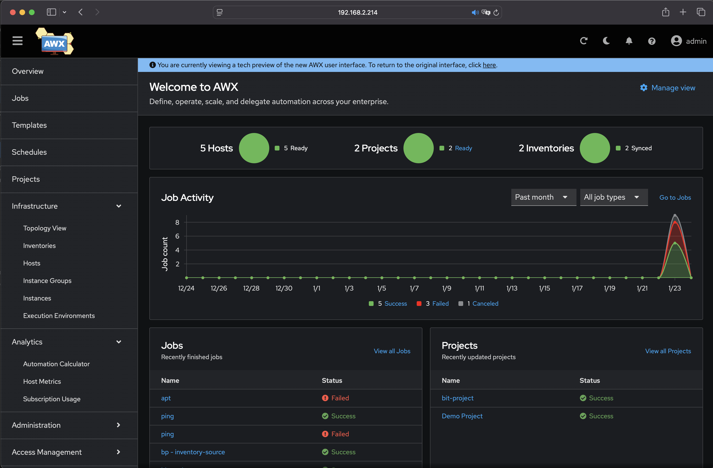

### Ansible-AWX kubernetes quick-start


#### Minimal configuration approach setup guide for getting startet with AWX. 
This can be used as a base setup to further customize and improve.

> While this setup guide was made using a microk8s target node to be easily reproducable, any kubernetes flavor is suitable. Only requirement is permission to write / create namespaces via kubectl and that the target platform can dynamically provision persistent volumes to allow postgresql instances to persist data.

###### Prerequisites:
 - target microk8s / minikube / managed k8s
 - kubectl
 - helm 2/3
---

###### 1. Setup AWX Operator
Optional: Enable local pv provisioner (microk8s only)
> *This command is executed on a microk8s node if required*
```bash
microk8s enable hostpath-storage
```
Add AWX-Operator Helm repo:

```bash
helm repo add awx-operator https://ansible-community.github.io/awx-operator-helm/
```

Install AWX-Operator chart in awx-operator namespace:

  ```bash
helm install awx-operator awx-operator/awx-operator -n awx-operator --create-namespace
```
###### 2. Setup first AWX Instance
Define AWX instance in ```awx-instance.yml```:

```yaml
---
apiVersion: awx.ansible.com/v1beta1
kind: AWX
metadata:
  name: awx-instance
spec:
  service_type: NodePort
```

Apply crd manifest to create AWX instance:
> *While awx-operator namespace is reused here, AWX instances can / should live in seperate namespaces in real world scenarios.*
```bash
kubectl apply -n awx-operator -f awx-instance.yml
```

###### 3. Access Ansible-AWX WebUi

Retrieve initial admin password:

```bash
kubectl get secret -n awx-operator awx-instance-admin-password -o jsonpath="{.data.password}" | base64 --decode ; echo
```

Get NodePort of webui:

```bash
kubectl get svc -n awx-operator -o go-template='{{range .items}}{{range.spec.ports}}{{if .nodePort}}{{.nodePort}}{{"\n"}}{{end}}{{end}}{{end}}'
```

Access AWX webui at ```http://KUBE_IP:NODE_PORT``` and login as ```admin``` using the retrieved password.
